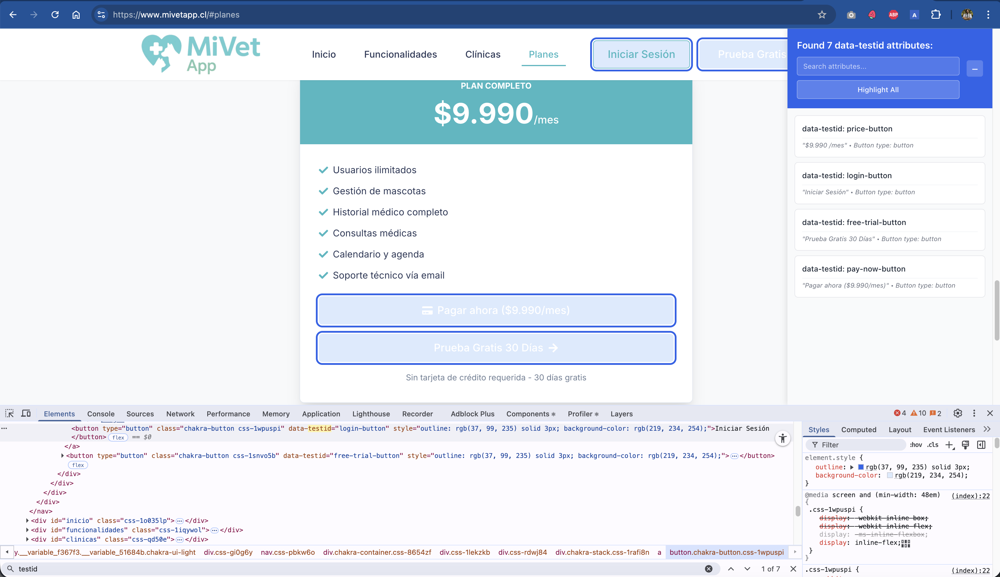

# Testing Tool - Attribute Highlighter

A Chrome extension that helps developers and QA engineers find and highlight configurable `data-*` attributes on web pages (e.g., `data-testid`).

## Screenshot



Place your screenshot at `assets/example-extension.png` or update the path above. Recommended size for store listing: at least 1280×800.

## Features

- Search and filter attributes in a panel
- Highlight all elements or individual groups
- Contextual info for each element (text, image filename, link href, inputs, buttons)
- Collapsible side panel (minimize to floating icon)
- Auto-updates when the page mutates
- Position-based sorting using rendered coordinates

## Permissions and Privacy

- Permissions: `storage` only (used to persist enable state and current attribute).
- No personal data is collected; no tracking; no remote calls.

## Installation (Unpacked)

1. Open Chrome and navigate to `chrome://extensions/`.
2. Enable "Developer mode".
3. Click "Load unpacked" and select this project folder.
4. Click the extension icon to open the popup.

## Usage

- Enter the attribute key (e.g., `testid` → searches `data-testid`).
- Toggle Enable/Disable from the popup.
- The side panel lists attribute values grouped by occurrence; click an item to highlight.
- Use "Highlight All" to toggle highlight on all matched elements.
- Use the search input in the panel header to filter groups.

## Packaging for Web Store

We provide a packaging script that creates a ZIP based on the manifest version.

```bash
npm run package
```

This produces `seo-extension-v<version>.zip` (e.g., `seo-extension-v1.1.0.zip`) excluding `node_modules`, `coverage`, tests, and `.DS_Store`.

## Publish to Chrome Web Store

1. Go to the Chrome Web Store Developer Dashboard.
2. Click "New Item" and upload the generated ZIP.
3. Fill in the listing:
   - Title and description.
   - Screenshots (≥1280×800), icon 128×128.
   - Category, visibility (Public/Unlisted).
   - Privacy: state you only use `storage` and collect no personal data.
   - Support email or URL.
4. Submit for review.

## Development

### Setup

```bash
npm install
```

### Scripts

- `npm test` — run tests (Jest, jsdom)
- `npm run lint` — lint with ESLint (v9 config)
- `npm run package` — build distributable ZIP

### Running Tests

```bash
npm test
npm run test:watch
npm run test:coverage
```

## Project Structure

```
seo-extension/
├── manifest.json
├── content.js                  # Content script (injects panel and highlights)
├── popup/
│   └── popup.html              # Extension popup UI
├── popup.js                    # Popup logic
├── styles/
│   ├── panel.css               # Panel styles
│   ├── popup.css               # Popup styles
│   └── theme.css               # Theme variables
├── src/
│   ├── constants.js
│   ├── content/contentEntry.js # Content entry orchestration
│   ├── core/                   # Core helpers (position, context info, panel changes)
│   ├── state/state.js          # ExtensionState management
│   ├── ui/panel.js             # Panel component
│   └── tests/*.test.js         # Unit tests
├── scripts/package.js          # Packaging helper
├── icon16.png
├── icon48.png
├── icon128.png
└── package.json
```

## License

MIT
